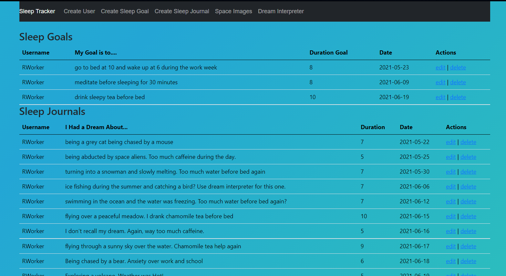

## Project Overview

When first opening the Single Page Application (SPA), the user is greeted with their previous Sleep Journal and Sleep Goal entries. The user can either review their entries or take actions such as edit or delete their entries. 

On the bottom of each page, the user can review their sleep metrics. The dataset is comprised of the duration of their Sleep Journals and the date that the Sleep Journal was created. 

The Sleep Journal and Sleep Goal prompts allow the user to select their name from a drop-down menu, input their dream or goal description, input the hours slept or goal hours, and select the date from the react-datepicker drop down menu.

Within the Dream Interpreter tab, the user can review their Sleep Journal entries and decide to input a word of choice. In the image below, I selected the word, "fishing", which returned relevant words from the DataMuse API (Application Programming Interface). 

To help the user get to sleep, I included an API call to NASA’s APOD or Astronomy Picture of the Day. The image and description returned will change each day.

[back](index.html)

